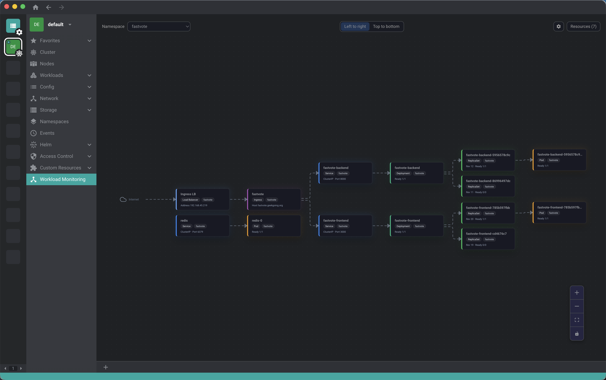

# Lens Flow

[](https://github.com/dev-minsoo/lens-flow/releases)
[](./LICENSE.md)

[English](./README.md)

Lens Flow는 Lens 계열 데스크톱 앱에서 동작하는 Kubernetes 토폴로지 익스텐션입니다. 클러스터 안의 라우팅, ownership, dependency를 한 화면에서 볼 수 있도록 **Workload Monitoring** 페이지를 추가합니다.

Lens에서 Kubernetes 리소스 관계를 확인하다 보면 Ingress, Service, Deployment, ReplicaSet, Pod, ConfigMap, Secret, PVC 화면을 계속 오가게 됩니다. Lens Flow는 이 흐름을 클러스터 화면 안에 그대로 두면서, 한눈에 따라갈 수 있는 그래프로 보여주기 위해 만들었습니다.

## 미리보기

<p>
  
</p>

<details>
  <summary>데모 GIF 보기</summary>
  <p>
    
  </p>
</details>

## 왜 Lens Flow인가

Kubernetes 리소스 관계는 보통 여러 화면에 흩어져 있습니다. Lens Flow는 자주 확인하는 경로를 하나의 그래프로 모아서 이런 질문에 더 빨리 답할 수 있게 합니다.

- 이 Ingress는 어떤 Service로 연결되는가?
- 이 Service 뒤에 실제로 어떤 workload가 있는가?
- 이 Deployment 아래에 어떤 ReplicaSet과 Pod가 있는가?
- 이 workload가 어떤 ConfigMap, Secret, PVC를 사용하는가?

## 지원 앱

- Lens 6+
- OpenLens 6+
- FreeLens 1.8.1+

이 익스텐션은 Lens renderer API를 사용하며 별도 사이드카 프로세스를 요구하지 않습니다.

## 주요 기능

- Internet, LoadBalancer, Ingress, Service, Deployment, ReplicaSet, StatefulSet, DaemonSet, Pod, ConfigMap, Secret, PVC 리소스 토폴로지 그래프
- Service에서 workload, workload에서 pod로 이어지는 관계 추적
- `env`, `envFrom`, `volumes` 기반 dependency edge 표시
- 클러스터 페이지 안에서 namespace 기준 탐색
- `All`, `None`, `Reset`이 있는 Resource 필터
- `Left to right`, `Top to bottom` 레이아웃 모드
- Minimap, controls 토글
- edge hover 강조와 클릭 가능한 리소스 카드

## 설치

### GitHub Releases에서 설치

1. [최신 릴리즈](https://github.com/dev-minsoo/lens-flow/releases/latest)를 엽니다.
2. 첨부된 `.tgz` asset을 다운로드합니다.
3. Lens, OpenLens, FreeLens를 엽니다.
4. Extensions 화면으로 이동합니다.
5. 다운로드한 `.tgz`를 설치합니다.

### 로컬 패키지 생성

```sh
npm install
npm run build
npm pack
```

그 후 생성된 `.tgz` 파일을 Extensions 화면에서 설치하면 됩니다.

## 사용 방법

1. 클러스터를 엽니다.
2. 좌측 메뉴에서 **Workload Monitoring**으로 이동합니다.
3. namespace를 선택합니다.
4. 필요하면 **Resources** 패널에서 표시할 리소스를 조정합니다.
5. edge에 마우스를 올려 연결 경로를 강조합니다.
6. 리소스 카드를 클릭해 기본 details pane을 엽니다.

## 설정 저장 경로

Lens Flow는 앱별로 설정을 저장합니다.

```text
Lens / OpenLens: ~/.k8slens/lens-flow/settings.json
FreeLens:        ~/.freelens/lens-flow/settings.json
```

저장되는 항목:

- 클러스터별 선택 namespace
- visible resource 종류
- 그래프 방향
- minimap 표시 여부
- controls 표시 여부

## 개발

```sh
npm install
npm run start
```

주요 명령:

- `npm run start` - webpack watch
- `npm run build` - production build
- `npm test` - graph/settings 테스트
- `npm pack` - 설치 가능한 패키지 생성

## Contributing

이슈와 PR은 언제든 환영합니다.

호환성 문제나 레이아웃 이슈를 제보할 때는 아래 정보를 함께 남겨주세요.

- 사용한 앱 이름과 버전
- 클러스터 및 리소스 구성
- 가능하면 스크린샷이나 짧은 GIF

## License

MIT
